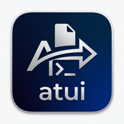

<p align="center">
  
</p>

<p align="center">
  <a href="https://snapcraft.io/aspera-terminal-ui">
    
  </a>
  
  
  
</p>

<p align="center">
  <a href="https://snapcraft.io/aspera-terminal-ui">
    
  </a>
</p>

# Aspera Terminal UI

A powerful, interactive terminal user interface for Aspera P2P/MySpace systems. `aspera-terminal-ui` simplifies the process of listing, sharing, and downloading files via Aspera without leaving your terminal.

## Features

- 🐚 **Interactive TUI**: Navigate through received and shared requests with a sleek, keyboard-driven interface.
- 🚀 **Smart Download**: Select specific files from a request or download everything with a single command.
- 🔄 **Share Files**: Share files and directories with other Aspera users directly from the terminal.
- 📁 **Dynamic Completion**: Tab-completion support for commands and Request IDs (fetches your latest requests automatically).
- 🔑 **Secure Auth**: Passwords securely stored in the system keyring.
- ⚡ **Auto-Token Refresh**: Never worry about "Session Expired" errors. Token renewal and re-authentication happen in the background.
- 📦 **Embedded Aspera Client**: No need to manually install Aspera; necessary binaries are extracted and set up for you.

## Installation

### Prerequisites
- Go 1.26 or higher (for building from source)
- Linux (currently optimized for Linux environments)

### Install via Snap (Linux)
The easiest way to install `aspera-terminal-ui` on any Linux distribution is via the Snap Store:
```bash
sudo snap install aspera-terminal-ui
```
After installation, you must connect the `password-manager-service` plug to allow the application to store your credentials securely in the system keyring:
```bash
sudo snap connect aspera-terminal-ui:password-manager-service
```

### Building from Source
```bash
go build -o aspera-terminal-ui
```

### Initial Setup
After building or installing, run the following command to extract embedded Aspera binaries and set up shell completion:
```bash
./aspera-terminal-ui install
```

## Usage

### 1. Login
```bash
./aspera-terminal-ui login
```
You will be prompted for your endpoint, client credentials, and user account. Your password is saved locally and securely to enable automatic token refresh.

### 2. List Requests
```bash
./aspera-terminal-ui list
```
View your received transfers in an interactive list. Use `Tab` to switch between **Received** and **Shared** lists.

### 3. Download Files
You can download files interactively or by providing a Request ID:

**Interactive Mode:**
```bash
./aspera-terminal-ui download
```

**Direct Mode:**
```bash
./aspera-terminal-ui download REQ123456789
```

**Specify Download Path:**
By default, files are downloaded to a new folder named after the request ID in your current working directory. You can specify a different base destination directory using the `--path` or `-p` option:
```bash
./aspera-terminal-ui download REQ123456789 --path /path/to/directory
```

### 4. Share Files
```bash
./aspera-terminal-ui share --to user@example.com --subject "Important Files" /path/to/file1 /path/to/file2
```

## Shell Completion
To enable Tab completion for your shell:

**Bash:**
```bash
echo 'source <(aspera-terminal-ui completion bash)' >> ~/.bashrc
source ~/.bashrc
```

**Zsh:**
```zsh
echo 'source <(aspera-terminal-ui completion zsh)' >> ~/.zshrc
source ~/.zshrc
```

## Configuration
Configuration is stored in `~/.config/aspera-terminal-ui/config.json`.

## Antigravity AI Agent Integration
This repository includes a workspace-scoped AI agent skill definition that helps LLM coding assistants like Antigravity understand how to build, run, and execute the `aspera-terminal-ui` command line interface.

The configuration is located at:
* [.agents/skills/aspera-terminal-ui/SKILL.md](.agents/skills/aspera-terminal-ui/SKILL.md)

When working in this workspace, Antigravity will automatically detect and load this skill, allowing the agent to assist with CLI tasks directly.

To load this skill globally so that Antigravity can understand and run this CLI in any directory/workspace on your system, copy the skill to your global customizations root:
```bash
mkdir -p ~/.gemini/config/skills/aspera-terminal-ui && cp .agents/skills/aspera-terminal-ui/SKILL.md ~/.gemini/config/skills/aspera-terminal-ui/SKILL.md
```

## License
MIT
